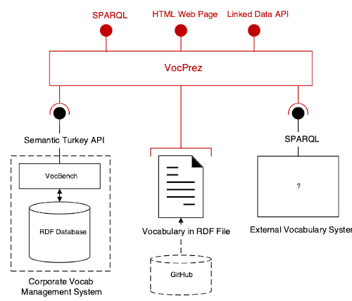

  

# VocPrez
A read-only web delivery system for Simple Knowledge Organization System (SKOS)-formulated RDF vocabularies.

VocPrez is used by:

&nbsp; |  | 
--- | --- | ---
&nbsp; | [Geological Survey of Queensland](https://www.business.qld.gov.au/industries/mining-energy-water/resources/geoscience-information/gsq) | [Geoscience Australia](https://www.ga.gov.au)
Instance| <https://vocabs.gsq.digital> | *coming!*

## VocPrez structure

  
**Figure 1**: An overview diagram of where VocPrez fits in relation to sources of vocab data.

VocPrez can get vocabularies from one or more *sources* and any instance can be tuned to use any set of *sources*. This allows for use with a wide range of back-end vocabulary management.

Technically, the tool is a SKOS-specific implementation of the [pyLDAPI](https://github.com/rdflib/pyLDAPI). pyLDAPI is a generic tool for the deliver of [RDF](https://www.w3.org/RDF/) data online in both human- and machine-readable formats; it turns data into *[Linked Data](https://www.w3.org/standards/semanticweb/data)*. 

## SKOS
pyLDAPI needs deployment-specific templates for the data it delivers to ensure that sensible views of the data are presented. VocPrez is really just pyLDAPI pre-configured with templates for SKOS' core data classes - `ConceptScheme`, `Collection` & `Concept` - and listings of them. It also assumes that a `ConceptScheme` is synonymous with a *Vocabulary*. VocPrez also provides some likely, and easily extensible, back-end data *source* adaptors so the vocabulary data - files, SPARQL endpoint, other - can be consumed easily.

This tool is *not* a SKOS data editor! It is expected to be used with a SKOS data source (any sort of datasource can be configured and three come pre-loaded) and its only role is to publish that SKOS data online as Linked Data and in a form compliant with the [Content Negoriation by Profile](https://www.w3.org/TR/dx-prof-conneg/) specification. 

The design goal for this tool was to provide an easily configurable template-based SKOS presenter since many of the other SKOS editing and presentation tools, available as of 2020, are pretty complex instruments and make life difficult for normal web development tasks such as institutional branding of vocabulary data.

Since this tool is preconfigured for SKOS data, it is ready for use with SKOS-only vocabularies. The code here can be extended for SKOS+ features. SKOS+ is a general term for SKOS data *plus some other bits*, for instance additional Dublin Core annotation properties or OWL relationships.


## API & Templates
VocPrez is based on [pyLDAPI](https://github.com/rdflib/pyLDAPI) which is, in turn, based on Python's [Flask](http://flask.pocoo.org/), a small HTTP framework. Flask understands HTTP messages and makes their content available for use within Python code. pyLDAPI provides a bunch of Python functions for handling and sending HTTP messages relevant to Linked Data scenarios.

As per other pyLDAPI deployments, VocPrez tool uses the [Jinja2 Python templating engine](http://jinja.pocoo.org/) to generate HTML and some of the other files it generates, filled out with data from whatever data source it's using. 

Standard templates for `ConceptScheme`, `Collection`, `Concept` & `Register` are contained within this repository.

The general structure of VocPrez is a form of Model-View-Controller application with the *Model* part being Python files in the folder `model/` that deal with creating Python representations of the data taken from the *source*, the *View* part being templating and other files in `view/` and the *Controller* part being the common Flask `routes.py` file within the folder `controller/` that directs the HTTP requestss.


## Installation
VocPrez, and pyLODE beneath it, are run just as any standard Flask application is run. Flask apps can be run in either of two modes: 1. Development, 2. Production.

**1. Development**  
For how to run a Flask app in development mode, see these resources:

* [Flask documentation *Qucikstart*](https://flask.palletsprojects.com/en/1.1.x/quickstart/)
* [Stack overflow question](https://stackoverflow.com/questions/29882642/how-to-run-a-flask-application)

**2. Production**  
Run Flask behind a regular web server like Apache or nginx.

* *Apache*: <https://www.jakowicz.com/flask-apache-wsgi/>
* *nginx*: <https://www.digitalocean.com/community/tutorials/how-to-serve-flask-applications-with-uwsgi-and-nginx-on-ubuntu-14-04>
 

### Configuration 
The VocPrez-specific configuration for running is as follows:

**1. Config File**  
This repo contains a config file *template* but not a working config file. This is to ensure passwords etc. aren't copied up to GitHub!

You need to copy the file `_config/template.py` to `_config/__init__.py` and configure variables within it. See the `template.py` file itself for examples.

**2. Data Source**  
You need to tell your instance of VocPrez where to get data from. You source of SKOS data could be any one of many (as per *Figure 1*, above). See the [DATA_SOURCES.md](DATA_SOURCES.md) file for example configurations.

### Dependencies
Before attempting to run a local copy of VocPrez, you need to ensure that all its dependencies - Python packages that VocPrez uses - are installed. These are listed in the [requirements.txt](requirements.txt) standard Python dependency listing file.

### Setup & Run
As noted above, VocPrez runs as any normal Flask server does and you need to have completed the two steps in *Configuration* above. Here are step-by-step instructions for Linux.

0. Clone this repository to your local machine or server

Install Git
```bash
sudo apt install git
```
Then
```bash
git clone https://github.com/RDFLib/VocPrez.git some-folder
```
This clones this repository's content into a folder called `some-folder`.

Move into that folder 

```bash
cd some-folder
```

1. Create a virtual Python environment for VocPrez' required packages
```bash
python3 -mt venv venv
```
This creates a Python virtual environment within the folder `venv/`

2. Activate, turn on, the created virtual environment
```bash
source venv/bin/activate
```

3. Install the Python packages required in the virtual environment
```bash
pip install -r requirements.txt
```

4. Just update the package pip!
```bash
pip install upgrade pip
``` 

5. Check that the contents of requirements.txt have been added
```bash
pip freeze
```
You should see a listing of all installed packages, and their versions

You are now ready to follow the steps in *Configuration* above

#### Run for development
Run using Python Flask's in-built web server:

```bash
python app.py
```
VocPrez should now be running at http://localhost:5000

#### Run for production
Rather than using Flask's in-built web server to run for production, you need to have a regular web server such as apache or nginx call the VocPrez application. So, rather than just running `python app.py`, you need to:

a. Install VocPrez as above
b. Install Apache/nginx
c. Configure Apache/nginx to hand off requests to Flask
d. Configure Flask to accept those requests

a. is addressed above. For b., just install the web server as normal.

For c., if using Apache, install the Apache/Python 3 WSGI module:

```bash
sudo apt-get -y install libapache2-mod-wsgi-py3
```
Then tell Apache about the VocPrez application. Edit one of the Apache config files (usually stored within `/etc/apache2/sites-available/`) to say something like this:

```
    <virtualhost *:80>
        ServerName vocprez.com
     
        WSGIDaemonProcess vocprez user=www-data group=www-data python-home=/var/www/gsq-permits-api/venv threads=5
        WSGIScriptAlias / /home/user/some-folder/app.wsgi
     
        <directory /home/user/some-folder>
            WSGIProcessGroup vocprez
            WSGIApplicationGroup %{GLOBAL}
            WSGIScriptReloading On
            Order deny,allow
            Allow from all
        </directory>
    </virtualhost> 
```
An example file containing the above information is in this repository: [apache.conf](apache.conf).

Here Apache's virtual host for the domain name *vocprez.com* is configures to send all requests to it the `app.wsgi` file in the VocPrez contents, here indicated as being stored at
`/home/user/some-folder/app.wsgi`. Since this example says `WSGIScriptAlias /`... - i.e. all URL paths after *vocprez.com* as opposed to any subfolders, *all* requests for this virtual host, *vocprez.com*, will be sent to this VocPrez instance.

The line starting `WSGIDaemonProcess` says that the user `www-data`, the standard Apache user, shall run this operation so file permissions for this user must be granted to the application's folder, `/home/user/some-folder/`. The directive `python-home=/var/www/gsq-permits-api/venv` indicates where the Python interpreter that should be used is and, in steps above, we created a virtual environment for this in the folder `venv/`.

For d., ensure that the file `app.wsgi` in the VocPrez code is configured to point to your VocPrez' installation directory:

```python
import sys
import logging
sys.path.insert(0, "/home/user/some-folder")  # ensure this points to your installation folder!
logging.basicConfig(stream=sys.stderr)

from app import app as application
```

Once Apache (or nginx) and VocPrez have been configured, Apache/nginx needs to be restarted and then, if configuration is correct, VocPrez will appear at:

<http://locahost>


## License
This code is licensed using the GPL v3 licence. See the [LICENSE file](LICENSE) for the deed.


## Tests
We use [pytest](https://docs.pytest.org/en/latest/) as our testing framework. Tests live in the [tests directory](_tests). These tests ensure that the endpoints are functioning as intended. See the [README.md](_tests/README.md) for the tests for more information.


## Contacts
*Author*:  
**Nicholas Car**  
*Data Systems Architect*  
[SURROUND Australia Pty Ltd](http://surroundaustralia.com)  
<nicholas.car@surroundaustralia.com>
