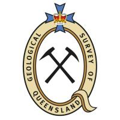
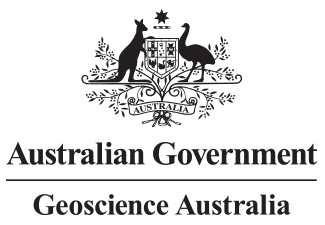

# VocPrez
A read-only web delivery system for Simple Knowledge Organization System (SKOS)-formulated RDF vocabularies.

VocPrez is used by:

&nbsp; |  | 
--- | --- | ---
&nbsp; | [Geological Survey of Queensland](https://www.business.qld.gov.au/industries/mining-energy-water/resources/geoscience-information/gsq) | [Geoscience Australia](https://www.ga.gov.au)
VocPrez Instance| <https://vocabs.gsq.digital> | *coming!*

## VocPrez structure

  

**Figure 1**: An overview diagram of where VocPrez fits in relation to sources of vocab data.

VocPrez can get vocabularies from one or more *sources* and any instance can be tuned to use any set of *sources*. This allows for use with a wide range of back-end vocabulary management.

Technically, the tool is a SKOS-specific implementation of the [pyLDAPI](https://github.com/rdflib/pyLDAPI). pyLDAPI is a generic tool for the deliver of [RDF](https://www.w3.org/RDF/) data online in both human- and machine-readable formats; it turns RDF data into *[Linked Data](https://www.w3.org/standards/semanticweb/data)*. 

## SKOS
pyLDAPI needs deployment-specific templates for registers & classes that present the data of interest in that deployment. VocPrez is pre-configured with templates for SKOS' core data classes - `ConceptScheme`, `Collection` & `Concept` - and registers of them. It also assumes that a `ConceptScheme` is synonymous with a *Vocabulary*.

This tool is *not* a SKOS data editor! It is expected to be used with a SKOS data source (any sort of datasource can be configured and three come pre-loaded) and its only role is to publish that SKOS data online as Linked Data.

The design goal for this tool was to provide an easily configurable template-based SKOS presenter since many of the other SKOS editing and presentation tools, available as of November 2018, are pretty complex instruments and make life difficult for normal web development tasks such as institutional branding of vocabulary data.

Since this tool is preconfigured for SKOS data, it is ready for use with SKOS-only vocabularies. Forks of this codebase can be made to enhance it for SKOS+ features. SKOS+ is a general term for SKOS data *plus some other bits*.

## API & Templates
As per other pyLDAPI deployments, this tool uses the [Jinja2 Python templating engine](http://jinja.pocoo.org/) to generate HTML and other files which are called fro use through Python's [Flask](http://flask.pocoo.org/), a small HTTP framework.

Standard templates for `ConceptScheme`, `Collection`, `Concept` & `Register` are contained within this repository, as is a Model-View-Controller-style deployment of Flask, pre-configures for SKOS.

## Installation
* follow the instructions as per pyLDAPI (see [its documentation](https://pyldapi.readthedocs.io))
* ensure your config file is correct
    * you need to copy the file `_config/template.py` to `_config/__init__.py` and configure carables within it. See the template.py` file for examples
* configure your data source(s)
    * you will need to supply this tool with SKOS data from any sort of data source: a triplestore, a relational database or even a local file
    * see the [DATA_SOURCES.md](https://github.com/CSIRO-enviro-informatics/VocPrez/blob/master/DATA_SOURCES.md) file for examples

## Dependencies
See the [requirements.txt](https://github.com/CSIRO-enviro-informatics/VocPrez/blob/master/requirements.txt) standard Python dependency listing file.

## License
This code is licensed using the GPL v3 licence. See the [LICENSE file](LICENSE) for the deed.

## Tests
We use [pytest](https://docs.pytest.org/en/latest/) as our testing framework. Tests live in the [tests directory](_tests). These tests ensure that the endpoints are functioning as intended. See the [README.md](_tests/README.md) for the tests for more information.

## Contacts
*Author*:  
**Nicholas Car**  
*Data Systems Architect*  
[SURROUND Australia Pty Ltd](http://surroundaustralia.com)  
<nicholas.car@surroundaustralia.com>

*Geoscience Australia contacts*:  
GA's Data Manager: <dataman@ga.gov.au>  
